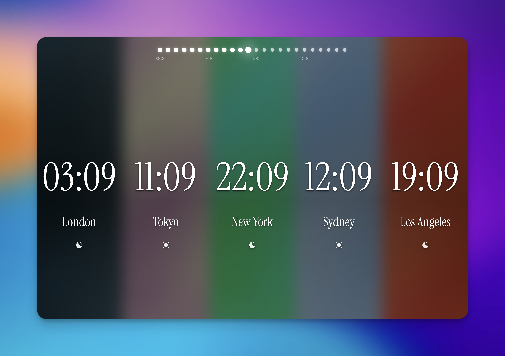

# 🌍 TimeZone App

An elegant, immersive multi-timezone display application with interactive timeline navigation and beautiful gradient backgrounds. Built with React, TypeScript, and modern web technologies.

## 📱 Preview



*Beautiful gradient backgrounds change dynamically based on time of day across different cities*

### What you see in the screenshot:
- **5 Cities Displayed**: London, Tokyo, New York, Sydney, Los Angeles
- **Interactive Timeline**: 24-hour dots at the top for time navigation
- **Dynamic Gradients**: Each city has unique colors based on local time
- **Day/Night Indicators**: Sun and moon icons showing local time of day
- **Real-time Updates**: Live time display for all selected timezones
- **Immersive Design**: Full-screen gradient sections with glassmorphism effects

## 🏷️ Status


## ✨ Features

### 🕐 **Interactive Timeline**
- **24-Hour Navigation**: Click any hour to see how all cities look at that time
- **Visual Progress Indicators**: Current vs future hours with smooth transitions
- **Keyboard Controls**: Arrow keys for navigation, R to reset, Escape to exit

### 🎨 **Beautiful Gradient Backgrounds**
- **32 Unique Gradients**: 8 cities × 4 time periods (morning/day/evening/night)
- **City-Specific Themes**: Each location has its own color palette
- **Dynamic Transitions**: Smooth color changes based on time of day
- **Glassmorphism Effects**: Modern blur and transparency effects

### 🌆 **Multi-City Display**
- **Support for 20+ Cities**: Major timezones around the world
- **Real-Time Updates**: Live time display with automatic refresh
- **Day/Night Indicators**: Custom sun/moon icons with visual feedback
- **Timezone Offset Display**: Clear UTC offset information

### 🛠️ **User Experience**
- **Responsive Design**: Fluid typography and mobile-optimized layouts
- **Persistent Settings**: Automatically saves your city preferences
- **Touch-Friendly**: Optimized for both desktop and mobile interaction
- **Smooth Animations**: 60fps transitions powered by Framer Motion

## 🚀 Quick Start

### Prerequisites
- Node.js 18+ 
- npm or yarn

### Installation

```bash
# Clone the repository
git clone https://github.com/aref-vc/timezone-app.git
cd timezone-app

# Install dependencies
npm install

# Start development server
npm run dev
```

The app will open at `http://localhost:3005` (or next available port).

### Production Build

```bash
# Build for production
npm run build

# Preview production build
npm run preview
```

## 🏗️ Project Structure

```
src/
├── components/           # Reusable UI components
│   ├── layout/          # Layout components (sections, bars)
│   ├── timeline/        # Timeline navigation components
│   ├── ui/              # Basic UI components
│   ├── CitySelector.tsx # City selection modal
│   ├── TimeZoneCard.tsx # Individual timezone card
│   └── index.ts         # Component exports
├── constants/           # App configuration and constants
│   ├── app.ts          # Settings, limits, animations
│   └── index.ts        # Constant exports
├── types/              # TypeScript type definitions
│   └── index.ts        # All interfaces and types
├── utils/              # Utility functions
│   ├── cities.ts       # City data and search
│   ├── storage.ts      # LocalStorage utilities
│   ├── styling.ts      # CSS class helpers
│   ├── timeZone.ts     # Time calculation functions
│   └── index.ts        # Utility exports
├── assets/             # Static assets (icons, images)
├── App.tsx             # Main application component
├── main.tsx            # Application entry point
└── index.css           # Global styles and gradients
```

## 🎯 Usage

### Basic Navigation
1. **View Current Times**: See live times for London and Tokyo (default cities)
2. **Add Cities**: Click the `+` button to add more cities (up to 6 total)
3. **Timeline Navigation**: Click any hour dot to explore times across all cities
4. **Reset View**: Press `R` or `Escape` to return to current time

### Keyboard Shortcuts
- `←/→ Arrow Keys`: Navigate timeline hour by hour
- `R`: Reset to current time
- `Escape`: Close modals and reset timeline

### Supported Cities
- **Europe**: London, Paris, Berlin, Istanbul, Moscow
- **Asia**: Tokyo, Singapore, Hong Kong, Mumbai, Seoul, Dubai
- **Americas**: New York, Los Angeles, Toronto, Vancouver, São Paulo
- **Africa**: Cairo, Cape Town
- **Oceania**: Sydney, Melbourne

## 🎨 Design System

### Typography
- **Primary Font**: Instrument Serif (elegant headings)
- **Monospace Font**: Courier Prime (time display)
- **UI Font**: Inter (interface elements)

### Color Palette
Each city has unique gradients for different times of day:
- **Morning**: Soft pastels and warm tones
- **Day**: Bright, energetic colors
- **Evening**: Rich sunset hues
- **Night**: Deep, cosmic tones

### Animations
- **Spring Transitions**: Natural motion with proper easing
- **Particle Effects**: Subtle floating elements
- **Hover States**: Interactive feedback on all controls

## ⚙️ Configuration

### Environment Variables
```bash
# Optional: Custom port (defaults to 3005)
VITE_PORT=3005
```

### Build Configuration
- **Vite**: Fast development and optimized builds
- **TypeScript**: Full type safety with strict mode
- **Tailwind CSS**: Utility-first styling with custom extensions
- **PostCSS**: Advanced CSS processing

## 🧪 Development

### Available Scripts
```bash
npm run dev        # Start development server
npm run build      # Build for production
npm run preview    # Preview production build
npm run lint       # Run ESLint
```

### Code Quality
- **TypeScript**: Strict type checking enabled
- **ESLint**: React and TypeScript rules
- **Prettier**: Consistent code formatting
- **Modular Architecture**: Clean separation of concerns

### Performance
- **Tree Shaking**: Minimal bundle size
- **Code Splitting**: Efficient loading strategies
- **GPU Acceleration**: Smooth 60fps animations
- **Memory Optimization**: Efficient re-rendering patterns

## 🌟 Contributing

Contributions are welcome! Please feel free to submit issues and pull requests.

### Development Guidelines
1. Follow the existing code structure and naming conventions
2. Add TypeScript types for all new interfaces
3. Include proper component documentation
4. Test changes across different screen sizes
5. Ensure animations remain smooth (60fps)

## 📄 License

This project is open source and available under the [MIT License](LICENSE).

## 🙏 Acknowledgments

- **Framer Motion**: Beautiful animations and gestures
- **Lucide React**: Clean, consistent icons
- **Tailwind CSS**: Rapid UI development
- **React 19**: Latest React features and performance improvements

---

**Built with ❤️ and modern web technologies**

For questions or support, please open an issue on GitHub.